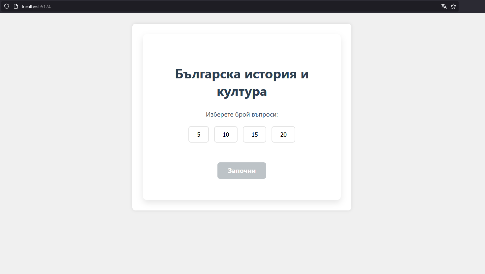
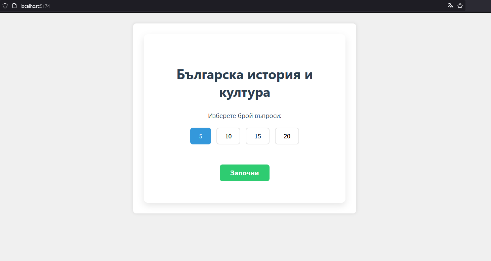
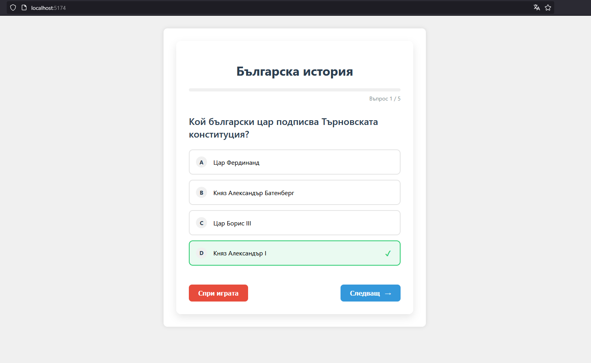
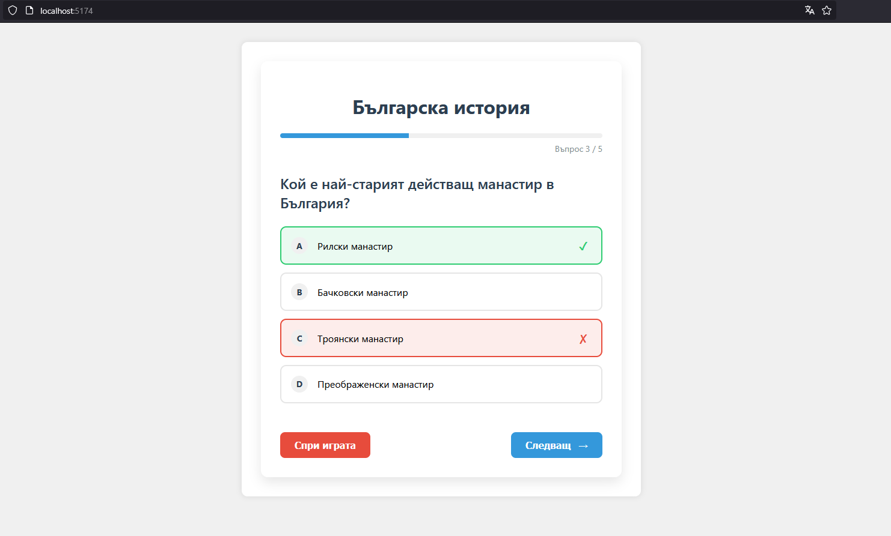
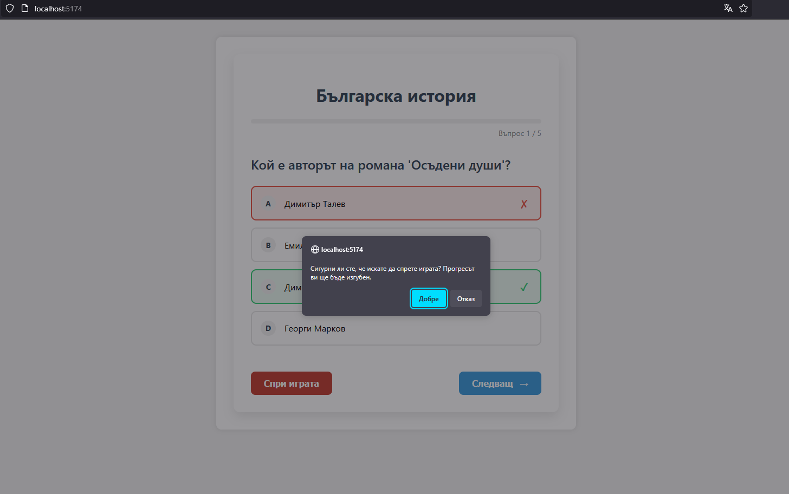
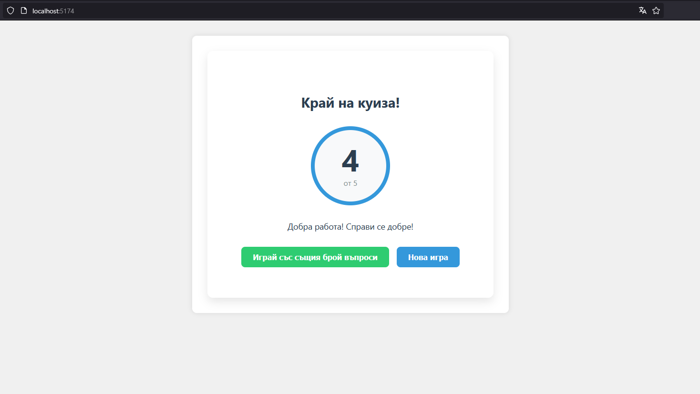

# 🇧🇬 Bulgaria at a Glance: Interactive Knowledge Quiz



## 📖 About the Project

**Bulgaria at a Glance** is an interactive quiz application developed with Vue.js, designed for fun and educational testing of knowledge about Bulgaria. The application includes questions from various fields - history, geography, literature, culture, and famous personalities.

Whether you're a student, teacher, or simply interested in Bulgaria, this quiz offers you an opportunity to test and expand your knowledge in an engaging way.

## ✨ Features

- **Choose number of questions** - Select between 5, 10, 15, or 20 questions
- **Random questions** - Each game offers different questions from the total set of 50
- **Immediate feedback** - Instantly find out if your answer is correct
- **Progress tracking** - Visual indicator shows how far you've progressed in the quiz
- **Result evaluation** - At the end, you receive a score and personalized message
- **Restart options** - Play again with the same number of questions or start a new game

## 🛠️ Technical Details

- Developed with **Vue 3** and Composition API
- Component-based architecture
- Responsive design, suitable for mobile devices
- External question file allowing easy expansion

## 📦 Installation

```bash
# Clone the repository
git clone https://github.com/vik-vel/quiz-app.git

# Navigate to the directory
cd quiz-app

# Install dependencies
npm install

# Start local server
npm run dev
```

## 🎮 How to Play

1. Select the number of questions from the start screen
2. Press "Start"
3. Read the question and choose one of four possible answers
4. After selection, you'll see if you answered correctly
5. Press "Next" to continue
6. At the end of the quiz, you'll see your score and be able to choose whether to play again

## 🖼️ App Screenshots







## 🔧 Customization

The quiz can be easily customized by editing the `questions.js` file. You can add new questions, modify existing ones, or add questions from new categories.

The question structure is as follows:

```javascript
{
  question: "Question here",
  answers: ["Answer 1", "Answer 2", "Answer 3", "Answer 4"],
  correct: 2  // Index of the correct answer (0-based)
}
```

## 📝 Planned Features

- Adding question categories
- Statistics for most frequently missed questions
- Answer timer
- Multiplayer mode

## 📄 License

MIT License.

## 👏 Acknowledgements

- Inspired by a love for Bulgarian history and culture

---

Developed with ❤️ for Bulgaria | © 2025
